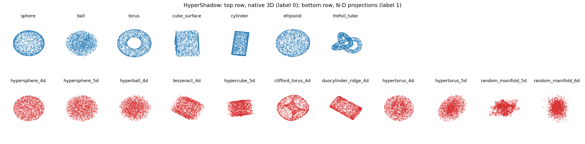
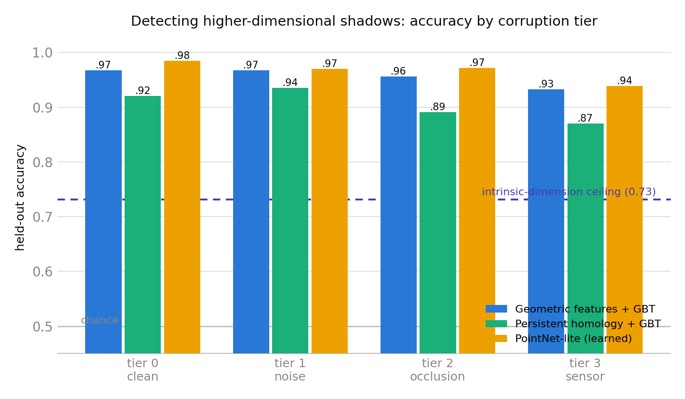

# HyperShadow

Can you tell whether a 3D point cloud is an ordinary 3D object, or the
3D projection (the "shadow") of an object from a higher spatial dimension?

This repository contains everything needed to study that question: a
synthetic dataset generator, the generated benchmark, baseline methods,
trained models, and the experiments behind the accompanying paper.

Nearly every dataset in machine learning that calls itself "4D" means
3D plus time. Here the 4th, 5th and 6th dimensions are spatial. As far as
I could find, no public dataset like this existed before.



## The task

Binary classification on point clouds of 1,024 points, centred and scaled
to unit mean radius:

| Label | Meaning | Shape families |
|---|---|---|
| 0 | native 3D object | sphere, solid ball, torus, cube surface, cylinder, ellipsoid, trefoil-knot tube |
| 1 | 3D projection of a 4D/5D/6D object | hyperspheres S3 and S4, solid 4-ball, tesseract, 5-cube, Clifford torus, duocylinder ridge, hypertori, random smooth manifolds |

Each higher-dimensional object gets a random rotation in R^N (Haar-uniform,
from a QR decomposition of a Gaussian matrix) and is then projected to R^3
either orthographically (drop the extra coordinates) or with a perspective
divide through each extra axis.

Four corruption tiers control difficulty. They are cumulative:

* tier 0: clean
* tier 1: Gaussian jitter, sigma = 2% of cloud scale
* tier 2: tier 1 plus removal of a random 20-40% half-space slab (self-occlusion)
* tier 3: tier 2 plus heavier jitter and distance-dependent point dropout
  (meant to imitate LiDAR-style sparsity)

There is also a temporal track: 16-frame sequences of one object rotating
rigidly at constant angular velocity. For label 0 the rotation happens in
R^3, for label 1 in R^N. Point identity is preserved across frames.

### Why the task is not trivial (and not solvable by cheating)

A few deliberate design decisions:

* Native shapes get the same random rotations and the same corruption
  tiers as the projections. No preprocessing difference between classes.
* Every cloud is centred, rescaled, and resampled to exactly 1,024 points,
  so position, size and point count carry no information.
* The native class includes a solid ball. A projected hypersphere fills a
  ball too, so "does it fill a volume" does not solve the task. Conversely
  the Clifford torus projects to a surface, so "is it a surface" fails as
  well. What actually separates the classes is subtler: how projection
  folds density and changes topology.
* Intrinsic-dimension estimation cannot solve it either, and this is a
  point the paper makes explicitly: a shadow is still at most 3-dimensional
  data. TwoNN and the Levina-Bickel MLE top out around 73% here.

## Results



Static track, 10,800 clouds, held-out evaluation:

| Method | Learned params | Accuracy |
|---|---|---|
| Chance | none | 0.500 |
| TwoNN threshold (Facco et al. 2017) | 0 | 0.710 |
| Levina-Bickel MLE threshold (2005) | 0 | 0.732 |
| Persistent homology + gradient boosting | n/a | 0.904 |
| Geometric features + gradient boosting | n/a | 0.956 |
| PointNet-lite | 190k | 0.966 |

Temporal track, 1,800 sequences: a zero-parameter test does better than
everything above. Fit the optimal rigid 3D alignment (Kabsch) between
consecutive frames and take the mean residual. Rigid 3D motion leaves a
residual near zero; the shadow of a rigid rotation in R^N cannot be
explained by any rigid 3D motion and leaves a residual around 4x larger.
One threshold on that number gives AUROC 0.982.

Generalization: training with whole shape families held out, the model
still detects them (hypertori 91%, hypercubes 79.5%), so it is learning
projection signatures rather than memorising the shape list. 5D objects
are consistently easier to detect than 4D ones. The tesseract is the
hardest object in the benchmark.

The consistent hardest confusion across all methods is the native solid
ball vs the projected hypersphere. That is expected: the shadow of S3 is
a ball, and only the radial density profile differs.

## Installation

Python 3.9+. Only NumPy is needed to generate data; the baselines need a
bit more.

```bash
python -m venv .venv
# Windows:
.venv\Scripts\pip install numpy matplotlib scikit-learn pytest
# baselines.tda additionally needs:  ripser persim
# baselines.pointnet additionally needs:  torch
```

PyTorch with CUDA is optional. The PointNet baseline was trained on a
GTX 1650 Ti with 4 GB of VRAM in about 4 minutes, and also runs on CPU.

## Usage

Generate the dataset (CPU only, a few minutes):

```bash
python -m hypershadow.generate --out data --per-class 600 --n-points 1024 --seed 0
python -m hypershadow.generate --out data --temporal --per-class 100 --n-frames 16 --seed 1
```

This writes `static.npz` / `temporal.npz` plus a JSON metadata file that
records, for every sample, the shape name, ambient dimension, corruption
tier and projection type.

Load it:

```python
import numpy as np
d = np.load("data/static.npz")
x, y = d["points"], d["labels"]   # float32 (N, 1024, 3), int64 (N,)
```

Run the baselines:

```bash
python -m baselines.features      --data data/static.npz
python -m baselines.id_estimators --data data/static.npz
python -m baselines.tda           --data data/static.npz --max-samples 1200
python -m baselines.pointnet      --data data/static.npz --epochs 60
python -m baselines.rigidity      --data data/temporal.npz
```

Leave-one-family-out generalization:

```bash
python -m baselines.pointnet --data data/static.npz --epochs 40 \
    --holdout-shapes hypertorus_4d hypertorus_5d
```

Figures and tests:

```bash
python -m hypershadow.visualize --out figures/gallery.png
python -m baselines.figure      --out figures/results.png
python -m pytest tests -q
```

## Repository layout

```
hypershadow/            dataset generator (NumPy only)
  primitives3d.py       native 3D samplers, uniform w.r.t. area or volume
  primitivesnd.py       4D-6D samplers
  rotations.py          Haar-random SO(N), smooth rotation paths
  project.py            orthographic and perspective N-D -> 3D projection
  corruptions.py        the four corruption tiers
  generate.py           CLI that builds the dataset files
  visualize.py          gallery figure
baselines/
  features.py           rotation-invariant geometric features + GBT
  id_estimators.py      TwoNN and Levina-Bickel MLE
  tda.py                persistence diagrams (ripser) + GBT
  pointnet.py           PointNet-lite training/eval, holdout option
  rigidity.py           the Kabsch rigidity test for the temporal track
  figure.py, diagrams.py  paper figures
tests/                  34 unit tests for the geometry and pipeline
results/                result JSONs and trained checkpoints
paper/                  the paper (main.tex, NeurIPS preprint format)
```

Everything is seeded; regenerating with the same seeds reproduces the
dataset and, up to GPU nondeterminism, the numbers.

## Adding your own shapes

Add a sampler to `hypershadow/primitivesnd.py` returning an `(n, d)` array
with `d >= 4`, register it in the `SAMPLERS` dict, and regenerate. The
tests in `tests/test_geometry.py` show what properties a sampler should
satisfy (finiteness, correct shape, uniformity where applicable).

## What this is and is not

This benchmark measures whether models can distinguish simulated
projections of higher-dimensional geometry from native 3D geometry, under
the stated simulation assumptions. It says nothing about whether higher
spatial dimensions exist physically, and the paper is explicit about that.
A detector firing on real data would only mean the data does not fit the
particular 3D model classes tested, which is a much weaker statement.

## Citation

```bibtex
@misc{hypershadow2026,
  title  = {HyperShadow: A Benchmark for Detecting 3D Projections of
            Higher-Dimensional Spatial Objects},
  author = {Sasi, Akshay},
  year   = {2026},
  url    = {https://github.com/AkshaySasi/hypershadow},
}
```

Dataset: https://huggingface.co/datasets/AkshaySasi/hypershadow
Models: https://huggingface.co/AkshaySasi/hypershadow-models

## License

MIT. See LICENSE.
